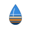

# Handoff: Koom Digital — Design System v2 "Water & Earth"

> **For:** the developer / Claude Code working in the real `xacobe/koom-digital` repo
> **Goal:** evolve the existing live site from the all-blue v1 into the v2 **"Water & Earth"** identity — a redrawn logo (no diamond), Burkina ochre as a true secondary colour, and more visible West African cultural motifs.

---

## 0. TL;DR — what to change in the repo

The live site already has a solid design system in `css/style.css`. **You are not rebuilding it — you are layering an "earth" pass on top of the existing "water" system.** Four concrete jobs:

1. **Logo** — replace the old "drop inside a diamond / rounded-square" mark with the new **woven water-drop** SVG (`assets/koom-logo-drop.svg`) in every page header; swap the favicon for `assets/koom-favicon.svg`.
2. **Colour** — add the ochre/laterite token family to `:root`, and start using it (primary CTA, local-language tags, featured pricing pack, eyebrows).
3. **Motifs** — replace the `--weave-band` and `--pattern-lattice-*` token values with the warmer versions so the existing Faso Dan Fani seams and bògòlanfini lattice carry ochre; add the new mudcloth band + section seams.
4. **Copy/structure** — make sure the agency type (web & Drupal agency, Ouagadougou) and the client types (NGOs · institutions · SMEs · startups · public sector) stay front-and-centre on the home hero.

All the exact code is in **`assets/koom-v2-additions.css`** — paste-ready.

---

## About the design files

The files under **`reference/`** are a **design reference built in HTML** — a navigable design-system document showing the intended look, tokens and components. **Do not ship the reference HTML as-is.** Your task is to apply the v2 changes to the **existing repo's** real HTML pages (`index.html`, `entreprises.html`, `ongs-institutions.html`, `contact.html`) and its `css/style.css`, using the patterns already established there (vanilla HTML/CSS/JS, CSS custom properties, no framework).

- `reference/Koom Digital Design System v2.html` — open in a browser to see everything rendered.
- `reference/assets/koom.css` — a **copy of your current production `css/style.css`** (the v1 base), for diffing.
- `reference/assets/ds-v2.css` — the full v2 layer (includes doc-only chrome; the *production-relevant* subset is already extracted for you into `assets/koom-v2-additions.css`).

## Fidelity

**High-fidelity.** All colours, fonts, spacing and SVGs are final. Recreate them exactly. Hex values and measurements below are authoritative.

---

## 1. The new logo system

The v1 mark (a water drop sitting inside a rounded-square tile with a faint diamond behind it) is **retired**. The diamond never sat well. The v2 mark is a **single drop of water whose body is woven like Faso Dan Fani cloth**: blue water fills the top ~60%, then a sand→ochre→deep-ochre **earth band** at the waterline, with one white ripple highlight.

Three provided forms (all in `assets/`):

| File | Form | Use |
|---|---|---|
| `koom-logo-drop.svg` | **Woven drop** (primary) | Page headers, hero lockups — anywhere with space |
| `koom-favicon.svg` | **Badge** (drop on red-earth ground, navy tile) | `<link rel="icon">`, app icons, avatars |
| `koom-logo-monoline.svg` | **Monoline** (1-colour outline + ochre stroke) | Stamps, embroidery, one-colour print |

**Wordmark lockup** (unchanged structure): `Koom` in **Syne 700**, a thin space, then `Digital` in **DM Sans 300**. On dark grounds `Koom` is `#FFFFFF` and `Digital` is `--koom-light (#85B7EB)`; on light, `Koom` is `--koom-navy` and `Digital` is `--koom-muted`.

**Clear space:** keep ≥ the height of the drop on every side.
**Don'ts:** don't desaturate the weave, don't stretch/distort, don't place the drop on an ochre ground (it disappears).

### Where to swap it
In each page's `<header>`, replace the existing inline logo SVG / `` with the woven drop. Example pattern to match the current markup:

```html
<a class="brand" href="/">
  
  <span class="brand-word"><strong>Koom</strong> <span>Digital</span></span>
</a>
```
And in `<head>`: `<link rel="icon" type="image/svg+xml" href="assets/koom-favicon.svg">`

> If the current build inlines the logo as an SVG `<symbol>` sprite, you can instead inline the contents of `koom-logo-drop.svg` as a new `<symbol id="koom-drop">` and reference it with `<use href="#koom-drop">`. Either approach is fine.

---

## 2. Colour — water + earth

The blues are unchanged and still lead. The v2 addition is the **laterite earth family**. Use ochre as roughly **one part to four** of blue — accents, not fields.

### Existing water palette (already in your `:root`, listed for reference)
| Token | Hex | Role |
|---|---|---|
| `--koom-navy` | `#042C53` | Darkest surfaces, footers, hero grounds |
| `--koom-deep` | `#0C447C` | Gradient partner, reversed mark ground |
| `--koom-blue` | `#185FA5` | **Primary** — buttons, links, the drop |
| `--koom-mid` | `#378ADD` | Hover, focus ring, highlights |
| `--koom-light` | `#85B7EB` | Accents/eyebrows on dark |
| `--koom-pale` | `#B5D4F4` | Body text on dark, motif strokes |
| `--koom-wash` | `#E6F1FB` | Cool tinted sections |
| `--koom-white` | `#F5F9FF` | Cool page background |
| `--koom-text` | `#0D1B2A` | Body text |
| `--koom-muted` | `#4A6785` | Secondary text |
| `--koom-border` | `#C8DDF2` | Hairlines, card outlines |

### NEW earth palette (add to `:root`)
| Token | Hex | Role |
|---|---|---|
| `--koom-ochre` | `#C2772E` | **Secondary** — CTAs, the earth in the weave |
| `--koom-ochre-deep` | `#8F501C` | Warm text on light, eyebrows |
| `--koom-clay` | `#A6452A` | Laterite red — rare deep accent |
| `--koom-sand` | `#E9CBA1` | Warm light, accents on dark |
| `--koom-ochre-wash` | `#F7EFE2` | Warm tinted surface |

**Contrast notes (WCAG AA):** `--koom-ochre #C2772E` on white is ~3.4:1 — fine for large text / UI / borders, **not** for body copy. For warm text on light use `--koom-ochre-deep #8F501C` (~5.6:1). White text on `--koom-ochre` is ~3.5:1 — OK for button labels at ≥16px bold (matches the existing button type).

---

## 3. Motifs — turn the culture up

The site already uses three West African references via CSS tokens; v2 makes them **warmer and more present**.

- **Faso Dan Fani weave (`--weave-band`)** — REPLACE the value with the warm version (now threads sand + ochre through the blues). It already drives `.weave-seam` (card tops, hero centre). Render seams at `background-size: 200px 100%`.
- **Bògòlanfini lattice (`--pattern-lattice-on-dark/-light`)** — REPLACE values with the bolder versions (ochre on dark, blue on light). Tile at `60px 60px`.
- **Mudcloth dentil band (`--mudcloth`, NEW)** — a zigzag earth band. Add a `.mud-band` element to the footer top, business-card edge, or hero base.
- **Section seams (`.section-seam`, NEW)** — a full-bleed woven divider; drop between major page sections instead of plain hairline rules.
- **Banco frieze** — unchanged from v1 (triangular dentils on dark hero edges).

All values are in `assets/koom-v2-additions.css`.

---

## 4. Components touched

| Component | Change |
|---|---|
| **Buttons** | Add `.btn-earth` (ochre bg, white label, hover → `--koom-ochre-deep`). Use it for the single most important action per screen (e.g. *Devis gratuit*, *WhatsApp*). `.btn-primary` (blue) stays the default. |
| **Tags** | Add `.tag--earth` to highlight the local-language tags (*Mooré*, *Fulfuldé*). |
| **Pricing — featured pack** | Change `.pack-card--featured` accent border + ribbon from blue to `--koom-ochre`. |
| **Eyebrows** | Shift `.eyebrow` to `--koom-ochre-deep` on light grounds; keep `--koom-sand` on dark. |
| **Forms** | Unchanged behaviour. Keep the `--koom-mid` focus ring + 4px halo (WCAG AA). Primary submit may use `.btn-earth`. |

Buttons/cards/forms otherwise keep their existing v1 geometry: pill buttons (`border-radius: 999px`), Syne 600 labels, `-2px` lift on hover, navy-tinted shadows, `0.35s cubic-bezier(.22,1,.36,1)` motion.

---

## 5. Copy & audience (keep this visible)

Koom Digital is a **web design & Drupal development agency in Ouagadougou, Burkina Faso**. *Koom* = "water" in Mooré (also the Drupal emblem). The brand promise is **"local presence, international standards" / "Digital roots, global reach."**

Make sure the home hero (and the meta/intro area) keeps stating, explicitly:
- **What:** web & Drupal agency, built locally.
- **Who for:** NGOs & institutions · public sector · SMEs & traders · startups.
- **Languages:** FR · EN · Mooré · Fulfuldé.

(The v2 reference cover and a "Who we build for" block model this.)

---

## Design tokens (quick reference)

**Spacing:** `xs .5rem · sm 1rem · md 1.5rem · lg 2.5rem · xl 4rem · 2xl 6rem`
**Radii:** `sm 8px · md 16px · lg 24px`; pills/buttons `999px`
**Shadows:** `--shadow-card`, `--shadow-soft` (both navy-tinted, never grey)
**Type:** Display = **Syne** (600/700/800); Body = **DM Sans** (300/400/500). H1 `clamp(2.2rem,5vw,3.6rem)` Syne 700 `-0.03em`; body `1rem/1.65`.
**Motion:** `0.35s cubic-bezier(.22,1,.36,1)`

---

## Files in this bundle

```
design_handoff_water_earth/
├── README.md                          ← this file
├── assets/
│   ├── koom-v2-additions.css          ← PASTE-READY tokens + component rules for css/style.css
│   ├── koom-logo-drop.svg             ← primary woven-drop logo
│   ├── koom-favicon.svg               ← badge favicon
│   └── koom-logo-monoline.svg         ← 1-colour logo
└── reference/
    ├── Koom Digital Design System v2.html   ← open in browser to see it all
    └── assets/
        ├── koom.css                   ← copy of your current production style.css (v1 base)
        ├── ds.css                     ← doc-chrome (reference only)
        ├── ds-v2.css                  ← full v2 layer (doc + production rules)
        └── favicon-v2.svg
```

## Suggested implementation order
1. Add the 5 ochre tokens + replace `--weave-band` / `--pattern-lattice-*` values in `:root` (from `koom-v2-additions.css`).
2. Drop in the 3 logo SVGs; swap header logo + favicon across all 4 pages.
3. Add `.btn-earth`, `.tag--earth`, `.mud-band`, `.section-seam`; apply earth to the featured pack + eyebrows.
4. Re-check contrast on any new ochre text (use `--koom-ochre-deep` for text).
5. Sanity-pass the home hero copy for the "what / who-for / languages" trio.
